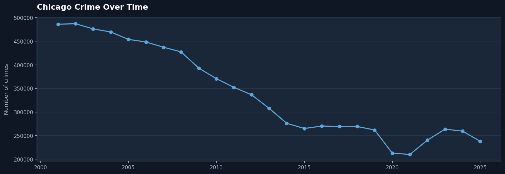
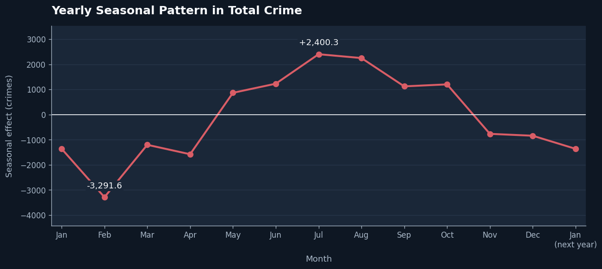
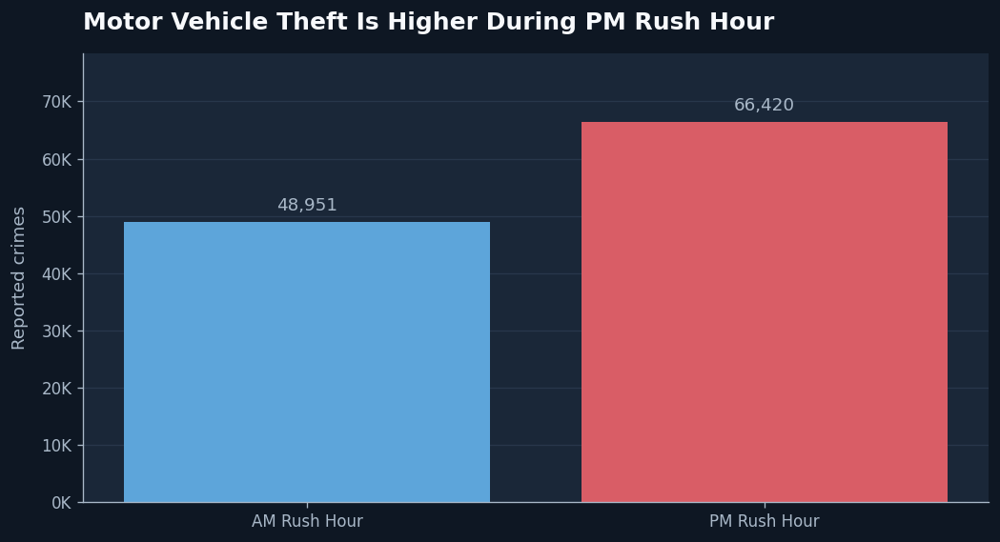
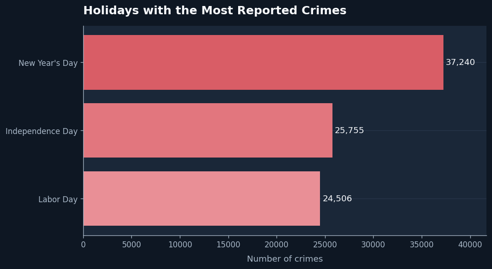
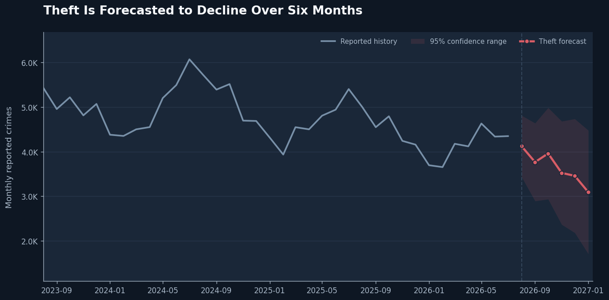
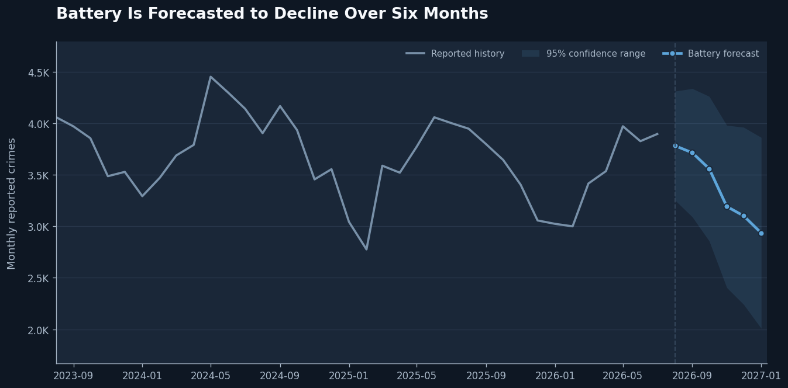
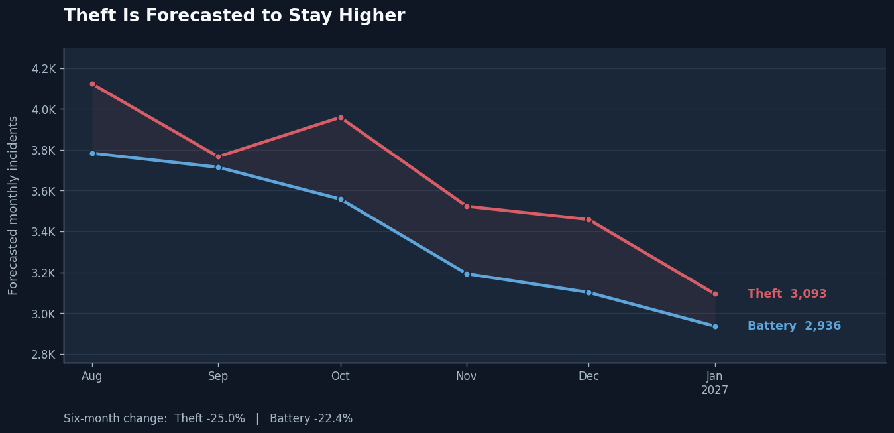
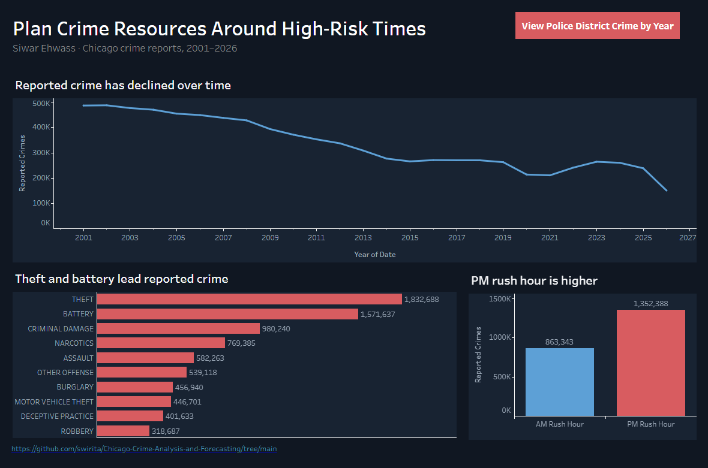

# Plan Crime Resources Around High-Risk Times

## Chicago crime patterns and six-month forecasts for better resource planning

**Author**: Siwar Ehwass

## Business Problem

Chicago law enforcement must allocate personnel and prevention resources during periods of changing demand. Historical crime reports are analyzed to identify long-term trends, rush-hour differences, holiday peaks, and seasonal patterns. Theft and Battery counts are also forecasted for the next six months to support staffing and resource decisions.

## Data

* **Source**: [Chicago Police Department: Crimes from 2001 to Present](https://data.cityofchicago.org/Public-Safety/Crimes-2001-to-Present/ijzp-q8t2/about_data)
* **Time range**: January 1, 2001 to September 3, 2026
* **Size**: 8,627,693 reported crimes
* **Added information**: US holiday name

## Methods

* Compared crime during AM and PM rush hours.
* Matched crime dates with the US holiday calendar.
* Used seasonal decomposition to study weekly and yearly patterns.
* Created monthly Theft and Battery time series.
* Tested each model on the final six months of known data.
* Used the complete time series to forecast six new months.

## Results

### Reported Crime Has Decreased Over Time

> Reported crime decreased by **51.1%**, from 485,974 reports in 2001 to 237,695 in 2025. However, 11 crime types increased during the same period, so the overall decrease does not tell the full story.

### Crime Follows a Yearly Pattern

> Reported crime usually reaches its highest point in **July** and its lowest point in **February**. Planning for the summer increase should begin before July.

### PM Rush Hour Has More Reported Crime

> PM rush hour had **1,352,388** reported crimes, compared with **863,343** during AM rush hour. Motor vehicle theft was also more common during PM rush hour.

### New Year's Day Has the Highest Holiday Count

> **New Year's Day** had the highest holiday crime count, followed by Independence Day and Labor Day.

## Forecasting Results

### Theft Forecast

* **Average monthly error**: approximately 262 crimes
* **Average percentage error**: **6.17%**

> Theft is forecasted to decrease from approximately **4,124 crimes** in the first forecast month to **3,093 crimes** in the final month. This is a predicted decrease of approximately **1,030 crimes**, or **24.99%**.

### Battery Forecast

* Explains 90% of the variation
* **Average monthly error**: approximately 90 crimes
* **Average percentage error**: **2.55%**

> Battery is forecasted to decrease from approximately **3,783 crimes** in the first forecast month to **2,936 crimes** in the final month. This is a predicted decrease of approximately **848 crimes**, or **22.40%**.

### Theft is Forecasted to Remain Higher

> Both crimes are forecasted to decrease, but Theft is expected to remain higher. By January 2027, the forecast reaches approximately **3,093 Theft incidents** and **2,936 Battery incidents**.

## Interactive Tableau Dashboard

This interactive dashboard allows users to explore reported Chicago crime patterns from 2001 through 2026. Users can compare yearly crime counts, common crime types, rush-hour patterns, and police districts.

> **Note:** The 2026 data is incomplete and includes reports through August 25 only.

[View the interactive dashboard on Tableau Public](https://public.tableau.com/shared/7Y9C3CT8S?:display_count=n&:origin=viz_share_link)

## Recommendations

* Put more staff and prevention resources into PM rush hour, when reported crime is much higher.
* Prepare for the yearly increase before July.
* Review coverage around New Year's Day, Independence Day, and Labor Day.
* Give slightly more attention and flexible resources to Theft because it is forecasted to remain higher than Battery.
* Do not make large resource cuts based only on the predicted decreases. Both crimes are still expected to have around 3,000 monthly incidents by January 2027.
* Update the forecasts every month when new data becomes available.

## Limitations and Next Steps

* The dataset includes reported crimes only.
* These patterns show when crime is higher, but they do not prove what caused it.
* The forecasts cover Chicago as a whole and do not show which neighborhoods need the most support.
* Weather, major events, policy changes, and other outside factors were not included.
* A useful next step would be forecasting by district and time of day for more focused resource planning.

## Further Links

* [View the analysis notebook](notebooks/02_crime_analysis.ipynb)
* [View the forecasting notebook](notebooks/03_crime_forecasting.ipynb)
* [View the original data source](https://data.cityofchicago.org/Public-Safety/Crimes-2001-to-Present/ijzp-q8t2/about_data)

## For Further Information

For any questions, contact **[siwarehwass@gmail.com](mailto:siwarehwass@gmail.com)**.
